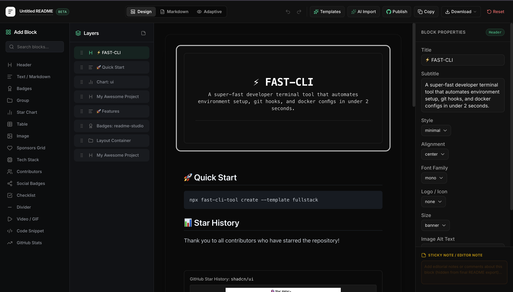

<div align="center">


# ✨ Readme Design

**Design beautiful GitHub READMEs, visually.**

A visual drag-and-drop editor for creating stunning GitHub READMEs — with live preview, AI autofill, 50+ templates, and one-click push to your repo.

[](https://readme-studio.vercel.app)
[](https://github.com/OM2309/readme-design/stargazers)
[](LICENSE)
[](https://nextjs.org)
[](https://www.typescriptlang.org)

<br />



<br />

[**🚀 Open Studio**](https://readme-studio.vercel.app/studio) · [**📖 Features**](#-features) · [**🤝 Contributing**](#-contributing)

</div>

---

## 🎯 What is Readme Design?

**Readme Design** is a free, open-source visual editor that makes creating GitHub READMEs effortless. No more wrestling with raw markdown — just drag blocks, customize, preview, and push.

> *"The best README is one people actually read."*

<br />

## ⚡ Features

<table>
<tr>
<td width="50%">

### 🧱 Drag-and-Drop Blocks
Compose your README from **headers, badges, tables, code blocks, images, charts, tech stacks, contributors**, and more. Reorder by dragging — no markdown syntax required.

### 👁️ GitHub-Accurate Preview
See **exactly** how your README renders on GitHub as you build — down to badge alignment, emoji shortcodes, and table formatting.

### 🤖 AI Autofill
Point it at a repo and let AI draft your **description, install steps, usage guide, and contributing section** in seconds.

</td>
<td width="50%">

### 📐 50+ Templates
Start from polished templates for **libraries, SaaS products, CLI tools, profile READMEs, API docs, hackathon projects**, and more — then make them yours.

### 🔍 Markdown Linting
Catch **broken links, heading gaps, and formatting issues** before they ship with inline, fixable warnings.

### 🚀 One-Click Push
Commit straight to your repository over a **secure GitHub connection** — no copy-paste, no local clone needed.

</td>
</tr>
</table>

<br />

## 🧱 Available Blocks

Every README section you'd ever need, available as a drag-and-drop block:

| Block | Description |
|:------|:------------|
| **📝 Header** | Project title with logo, subtitle, badges, and alignment options |
| **📄 Text / Markdown** | Rich markdown content with full formatting support |
| **🏷️ Badges** | Shields.io badges — npm, build status, license, coverage, and more |
| **📊 Chart** | Visual charts and graphs for stats and data |
| **📋 Table** | Formatted tables for API docs, comparisons, and data |
| **🖼️ Image** | Images with captions, sizing, and alignment controls |
| **💻 Code Snippet** | Syntax-highlighted code blocks with language selection |
| **🎥 Video / GIF** | Embed demo videos, screencasts, and GIF walkthroughs |
| **🛠️ Tech Stack** | Technology badges grid with icons and categories |
| **👥 Contributors** | Auto-generated contributor avatars and links |
| **🔗 Social Badges** | GitHub, Twitter, LinkedIn, YouTube, and other social links |
| **❤️ Sponsors Grid** | Sponsor logos and supporter recognition |
| **📈 GitHub Stats** | Live star history chart and GitHub statistics |
| **📦 Group** | Container for nesting and organizing blocks |
| **➖ Divider** | Visual separators between sections |
| **✅ Checklist** | Interactive checklist items for roadmaps and todos |

<br />

## 📐 Templates

Get started instantly with purpose-built templates:

| Template | Best For | Includes |
|:---------|:---------|:---------|
| **🚀 Product / SaaS** | Digital products, open-core tools | Hero section, feature grid, tech stack, CTA |
| **👤 GitHub Profile** | Personal profile READMEs | Gradient banner, bio, sponsors grid, links |
| **⚡ CLI Developer Tool** | Terminal tools, dev automation | Minimal header, features list, star chart |
| **📦 Minimal Boilerplate** | Libraries, APIs, packages | Badges, installation, usage snippets |
| **🎬 YouTube Channel** | Content creators, streamers | Header banner, video embed, social links |
| **🏆 Hackathon Project** | Competition submissions | Video demo, features checklist, team section |
| **🔌 REST API** | API documentation | Auth docs, endpoints, error codes |
| **📘 NPM Package** | NPM/Node libraries | Installation, API table, contributing guide |
| **🧰 Modern Toolkit** | Frameworks, high-perf tools | Feature table, star history, performance |

<br />

## 🛠️ Tech Stack

<div align="center">

| Layer | Technology |
|:------|:-----------|
| **Framework** | [Next.js 16](https://nextjs.org) with App Router |
| **Language** | [TypeScript 5](https://www.typescriptlang.org) |
| **Styling** | [Tailwind CSS 4](https://tailwindcss.com) |
| **UI Components** | [shadcn/ui](https://ui.shadcn.com) + [Base UI](https://base-ui.com) |
| **Drag & Drop** | [@dnd-kit](https://dndkit.com) |
| **Code Editor** | [Monaco Editor](https://microsoft.github.io/monaco-editor/) |
| **State Management** | [Zustand](https://zustand.docs.pmnd.rs) |
| **Authentication** | [NextAuth.js v5](https://authjs.dev) |
| **Database** | [Supabase](https://supabase.com) |
| **Markdown** | [react-markdown](https://github.com/remarkjs/react-markdown) + remark-gfm |
| **Deployment** | [Vercel](https://vercel.com) |

</div>

<br />

## 🚀 Quick Start

### Prerequisites

- **Node.js** 18+  
- **pnpm** (recommended) or npm

### Installation

```bash
# Clone the repository
git clone https://github.com/OM2309/readme-design.git

# Navigate to the project
cd readme-design

# Install dependencies
pnpm install

# Set up environment variables
cp .env.example .env.local

# Start the development server
pnpm dev
```

The app will be running at **[http://localhost:3000](http://localhost:3000)** 🎉

### Environment Variables

Create a `.env.local` file with the following:

```env
# GitHub OAuth (for one-click push)
AUTH_GITHUB_ID=your_github_client_id
AUTH_GITHUB_SECRET=your_github_client_secret
AUTH_SECRET=your_auth_secret

# Supabase (for publishing/storage)
NEXT_PUBLIC_SUPABASE_URL=your_supabase_url
NEXT_PUBLIC_SUPABASE_ANON_KEY=your_supabase_anon_key

# AI Autofill (optional)
GEMINI_API_KEY=your_gemini_api_key
```

<br />

## ⌨️ Keyboard Shortcuts

The studio comes with a full set of keyboard shortcuts for power users:

| Shortcut | Action |
|:---------|:-------|
| <kbd>Ctrl</kbd> + <kbd>K</kbd> | Open command palette |
| <kbd>Ctrl</kbd> + <kbd>S</kbd> | Save / Export markdown |
| <kbd>Ctrl</kbd> + <kbd>Z</kbd> | Undo |
| <kbd>Ctrl</kbd> + <kbd>Shift</kbd> + <kbd>Z</kbd> | Redo |
| <kbd>Ctrl</kbd> + <kbd>D</kbd> | Duplicate selected block |
| <kbd>Delete</kbd> | Delete selected block |
| <kbd>Ctrl</kbd> + <kbd>E</kbd> | Toggle markdown editor |

<br />

## 📁 Project Structure

```
readme-design/
├── public/              # Static assets & preview images
├── src/
│   ├── app/
│   │   ├── api/         # API routes (AI autofill, auth)
│   │   ├── studio/      # Studio editor page
│   │   ├── page.tsx     # Landing page
│   │   └── layout.tsx   # Root layout
│   ├── components/
│   │   ├── Canvas.tsx        # Main drag-and-drop canvas
│   │   ├── LeftSidebar.tsx   # Block palette & layers panel
│   │   ├── RightSidebar.tsx  # Block properties editor
│   │   ├── Navbar.tsx        # Studio toolbar
│   │   ├── GitHubPreview.tsx # Live GitHub-accurate preview
│   │   ├── MarkdownEditor.tsx # Raw markdown editor
│   │   ├── TemplateLibrary.tsx # Template picker
│   │   ├── CommandPalette.tsx  # Cmd+K command palette
│   │   └── ui/               # shadcn/ui components
│   └── store/
│       ├── readmeStore.ts     # Zustand store (blocks, undo/redo)
│       ├── blockRegistry.ts   # Block type definitions
│       └── defaultProps.ts    # Default block properties
├── package.json
└── tsconfig.json
```

<br />

## 🤝 Contributing

Contributions are what make the open-source community amazing. Any contributions you make are **greatly appreciated**.

1. **Fork** the repository
2. **Create** your feature branch → `git checkout -b feature/amazing-feature`
3. **Commit** your changes → `git commit -m 'Add amazing feature'`
4. **Push** to the branch → `git push origin feature/amazing-feature`
5. **Open** a Pull Request

### Ideas for Contributions

- 🎨 New block types (flowcharts, accordions, tabs)
- 📐 More templates for different project types
- 🌍 Internationalization (i18n) support
- ♿ Accessibility improvements
- 📱 Mobile responsive editor
- 🔌 VS Code extension

<br />

## 📜 License

This project is licensed under the **MIT License** — see the [LICENSE](LICENSE) file for details.

<br />

## ⭐ Star History

<div align="center">

[](https://star-history.com/#OM2309/readme-design&Date)

</div>

<br />

---

<div align="center">

**Built with ❤️ by [Om](https://github.com/OM2309)**

If you found this helpful, please consider giving it a ⭐

[**🚀 Open Studio**](https://readme-studio.vercel.app/studio) · [**🐛 Report Bug**](https://github.com/OM2309/readme-design/issues) · [**💡 Request Feature**](https://github.com/OM2309/readme-design/issues)

</div>